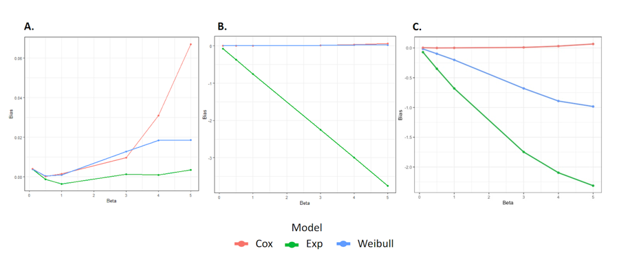

```{r setup, include=FALSE}
knitr::opts_chunk$set(echo = TRUE)
library(tidyverse)
library(survival)
source("./sim.R")
```

## Problem Statement

Time-to-event data can be modeled using proportional hazards to investigate the effect of exposure or treatment on time-to-event. A hazard rate describes the likelihood of an event (ie death, disease onset) occuring at time t and is written as the following: $h_i(t) = h_0(t)exp(x_{i})$. A proportional hazards model can then used to describe a hazard rate between two treatment or exposure groups:  $\frac{h(t\left|x_1\right.)}{h(t\left|x_2\right.)}=exp(\beta^{T}(x_1-x_2) )$. This model is useful as it no longer becomes dependent on time t. However, when fitting a survival model, assumptions must still be made about the baseline hazard function,$h_0(t)$, which is a function that describes the risk of death when all other covariates are equal to zero.  

The exponential and Weibull proportional hazards models are parametric functions, whereby the exponential assumes a constant baseline hazard $(h_0(t) =\lambda )$ while the Weibull assumes a baseline hazard as a function of time-to-event $(h_0(t) = \lambda \gamma t^{\gamma-1})$. On the other hand, the Cox proportional hazards model is a semi-parametric model, designed to be a more flexible model by not having to specify the baseline hazard function. Depending on the data, choosing the wrong assumptions can lead to inaccurate estimates of the treatment effect. In order to explore the issues related to misspecifying the baseline hazard function, we designed a simulation study to assess three survival models on three different baseline hazard function scenarios. Each scenario generates data based on different baseline hazard functions: exponential, Weibull, and an unspecified Gompertz hazard function. Then an exponential, Weibull, and Cox proportional hazards model are evaluated with each scenario.

## Methods

### Data Generation

Generating survival data involves 5 components: actual event time, censoring time, status indicator, observed time, and covariates, if needed. In order to generate event time, we can utilize the relationship between the survival function, $S(t)$, and hazard function $h(t)$ to obtain a direct relationship between the survival function, $S(t)$, and the baseline hazard function, $h_{0}(t)$. Survival function is the probability of surviving beyond time $t$


$$S(t) = P(T > t) = 1 - F(t)$$
Hazard function is the instantaneous rate at which the event occurs at time $t$ and can be defined as 
$$h(t) = \cfrac{f(t)}{S(t)} = \cfrac{f(t)}{1 - F(t)}
= -\cfrac{\partial}{\partial y}log[1 - F(t)] 
= -\cfrac{\partial}{\partial y}log[S(t)] $$

Isolating $S(t)$, we find $$S(t) = e^{-H(t)}, where\ H(t) = \int_{0}^{t} h(t)dt $$
Additionally, we can find the connection between the cumulative hazard, $H(t)$, and the baseline hazard. Given that $h(t) = h_{0}(t)e^{x^T \beta}$,
$$H(t) = \int_{0}^{t} h_{0}(t)e^{x^T \beta}dt 
= e^{x^T \beta}H_{0}(t), where\ H_{0}(t) = \int_{0}^{t} h_{0}(t)dt$$ 
Putting it all together, we obtain 
$$S(t) = e^{-H(t)} \\
 = e^{x^T \beta}H_{0}(t)$$
Finally, utilize the inverse transformation method to obtain $T$, event time
$$T = H^{-1}_{0} \bigg(\cfrac{-log(u)}{e^{x^T \beta}} \bigg), where\ U \sim U(0,1)$$

With a specific baseline hazard function, it is straightfoward to find generate time to event
\begin{enumerate}
  \item Under exponential distribution:
  \begin{center}
  Baseline hazard function: $h_{0}(t) = \lambda, where\ \lambda > 0$
  
  Cumulative hazard function: $H_{0}(t) = \lambda t$
  
  Inverse cumulative hazard function: $H_{0}^{-1}(t) = \cfrac{t}{\lambda}$
  
  Survival time: $T = -\cfrac{log(u)}{\lambda e^{x^T\beta}}$
  \end{center}
  
  \item Under weibull distribution:
  \begin{center}
  Baseline hazard function: $h_{0}(t) = \lambda \gamma t^{\gamma - 1}, where\ \lambda,\gamma > 0$
  
  Cumulative hazard function: $H_{0}(t) = \lambda t^{\gamma}$
  
  Inverse cumulative hazard function: $H_{0}^{-1}(t) = \bigg(\cfrac{t}{\lambda}\bigg)^{\cfrac{1}{\gamma}}$
  
  Survival time: $T = \bigg(-\cfrac{log(u)}{\lambda e^{x^T\beta}}\bigg)^{\cfrac{1}{\gamma}}$
  \end{center}
  
  \item Under gompertz distribution:
  \begin{center}
  Baseline hazard function: $h_{0}(t) = e^{\alpha t}, where\ \lambda > 0,-\infty< \alpha < \infty$
  
  Cumulative hazard function: $H_{0}(t) = \cfrac{\lambda}{\alpha}\bigg(e^{\alpha t}-1\bigg)$
  
  Inverse cumulative hazard function: $H_{0}^{-1}(t) = \cfrac{1}{\alpha}log\bigg(\cfrac{\alpha}{\lambda}t + 1\bigg)$
  
  Survival time: $T = \cfrac{1}{\alpha}log\bigg(1 - \cfrac{\alpha log(u)}{\lambda e^{x^T \beta}} \bigg)$
  \end{center}
\end{enumerate}

Under the 3 scenarios, we use the following steps to generate the survival dataset
\begin{enumerate}
  \item Randomly generate $X_{i}$, treatment assignment variable, from a bernoulli distribution with $p = 0.5$

  \item Generate $T_{i}$, time to event, using $X_{i}$ from step 1 and pre-specified $\beta$
$$T = H^{-1}_{0} \bigg(\cfrac{-log(u)}{e^{x^T \beta}} \bigg)$$

  \item Randomly generate $C_{i}$, censoring time, from an exponential distribution

  \item Determine the observe time, $Y_{i}$ by comparing event and censoring time
$$Y_{i} = min(T_{i}, C_{i}) $$
  \item Create the status indicator variable, where 1 represents if event is observed and 0 if event is censored

$$Status = 
    \begin{cases}
      1, & T_{i}\le C_{i} \\
      0, &  T_{i} > C_{i}
    \end{cases}$$
\end{enumerate}
    

    
### Scenario Simiulation

We conducted simulation studies to assess the performance of the proposed framework under three scenarios with different baseline hazards. Each time, data was generated to follow the specified baseline hazard function: exponential, Weibull, and an unspecified Gompertz hazard function. Then the generated data were fitted to exponential, Weibull, and Cox proportional hazard models. The parameters in each model were held constant with $\beta = 4$, $\lambda = 0.1$ and $\alpha = 4$. 

First, we simulated 1000 uncensored data sets with sample size N = 400. After running the three models in each scenario, a set of $\beta$'s were extracted and used to calculate the mean and $95\%$ confidence interval for comparison. In addition, we were interested in assessing the effect of different $\beta$ coefficients on performance across the three models. Using uncensored data, we varied the treatment effect, $\beta$, and observed the change in MSE and bias in order to explore the differences of the 3 models due the strength of treatment effect. 

Finally, we were interested in the effect of varying the sample size as well as observe the difference in model performance for censored and uncensored data. Therefore, we simulated uncensored and censored datasets of different sample sizes from 100 to 500. Then the MSE and bias were calculated to demonstrate the performance of survival models as the sample size increases for censored and uncensored data. All the data generation and simulation were performed in R version 3.6.1


## Results

Table 1, as below, contains point estimates and $95\%$ confidence intervals of three models using 1000 simulations of uncensored data with sample size of 400 and true $\beta=4$. With the true baseline hazard as exponential, the exponential proportional model has approximately the same point estimate as the true $\beta$, with a narrow $95\%$ CI. Weibull and Cox have similar point estimates but cox has a slightly larger CI. With a weibull baseline hazard, the weibull model provides the most accurate estimation of the treatment effect, as expected, with a narrow CI. Cox performs the second best, with a small deviation from the true $\beta$, but the exponential model significantly deviates from the true treatment and its CI fails to capture the true $\beta$. With the Gompertz baseline hazard, both exponential and weibull proportional models deviate from the true $\beta$ and their $95\%$ CIs fail to include the true $\beta$. Cox model, which makes no assumption about the baseline hazard, fits well.


\begin{center}
Table 1. Point estimates and $95\%$ confidence intervals
\end{center}

### Effect of varying $\beta$ on MSE and Bias across the three scenarios using uncensored data


\begin{center}
Figure 1. Differences in MSE due to varying $\beta$ across three scenarios in uncensored data\\(A: under exponential;B:under weibull;C: under cox)
\end{center}


From Figure 1, under the exponential baseline hazard, as the treatment effect varies, the exponential model performs the best. Performance for cox and weibull model worsens with increasing $\beta$. Under the weibull baseline hazard, the weibull and cox model perform best as the MSE is fairly small for varied treatment effects. Performance for the exponential model significantly worsens as $\beta$ increases. Under the Gompertz baseline baseline, the cox model performs the best; meanwhile, weibull and exponential have an increased MSE as treatment effect increases, with exponential performing worst.


\begin{center}
Figure 2. Differences in Bias due to varying $\beta$ across three scenarios in uncensored data\\(A: under exponential; B: under weibull; C: under cox)
\end{center}

In Figure 2, the bias trends among three scenarios are similar to those of MSE. Under the exponential baseline hazard, the exponential performs well with lower bias, whereas cox and weibull models perform worse as treatment effect becomes stronger. In the weibull scenario, both cox and weibull models perform well, keeping bias low. However, the exponential model increasingly underestimates the treatment effect as it becomes larger. With the gompertz baseline hazard function, the Cox model shows consistently high performance with varying treatment effects. Weibull and exponential models decrease in performance with bias deviating further from 0 as the treatment effect become larger. 


### Effect of varying sample size on MSE and Bias across the three scenarios using uncensored and censored data


\begin{center}
Figure 3. Differences in performance due to varying sample size under an exponential baseline hazard function\\
(A: MSE; B: Bias)
\end{center}

Under exponential baseline hazard, all three models hold similar trends in MSE and bias for censored and uncensored data. Overall, the models perform slightly better (larger MSE and bias) with uncensored data than censored data. The exponential model demonstrates a good fit with low MSE and bias across all sample sizes. Weibull model performs second best while the Cox model fits the data poorly for small sample size but improves as the sample size becomes larger.


\begin{center}
Figure 4. Differences in performance due to varying sample size under an weibull baseline hazard function\\
(A: MSE; B: Bias)
\end{center}

Using weibull baseline hazard function, the weibull model fits the best and exponential model performs worst with relatively high values of bias and MSE in both censored and uncensored datasets. At the beginning, cox has worse performance in comparison to weibull but stabilizes towards weibull as the sample size increases. There is a small difference in performance for censored and uncensored. 


\begin{center}
Figure 5. Differences in performance due to varying sample size under an gompertz baseline hazard function\\
(A: MSE; B: Bias)
\end{center}

In the gompertz baseline scenario, exponential model performs the worst for censored and uncensored data. At smaller sample size, cox has higher MSE than exponential and weibull. However, its MSE stabilizes and becomes the lowest out of the three as sample sizes increases. Weibull and cox consistently undestimate the treatment effect even as sample size varies. Once again, there is little difference between performance on censored and uncensored data.


## Discussion

From the results above, we generally conclude that using the correctly specified proportional hazard model will have the best performance. These patterns hold as sample size and treatment effects are varied in additional simulations. In our initial thinking, Cox model should perform the best under any scenario, with lower MSEs and Bias. This is because Cox model was explicitly designed to estimate the proportional hazard ratios without having to estimate the baseline hazard function, or in other words, limiting errors from incorrect assumptions. Indeed, the Cox model performed quite well in Scenarios 2 and 3 where the baseline hazard functions were more complicated. But this kind of flexibility has weakness in the case of a simple baseline hazard function as we saw in Scenario 1. We also noticed that Cox models needed a large sample size (greater than 200) to perform well. In addition, we expected the models to perform worse on censored data (higher MSEs and increased bias) with the beta approximations increasing in variability. Unlike uncensored data, censored data distorts the data with loss to follow-up and unrelated deaths, making approximation of the true effect more difficult. However, this was not strongly observed in our simulations and might require further inspection.

Based on our findings from the simulation study, we have identified areas for improvement and exploration. Unlike the current study where we fixed the hazard function input values, we should vary the values of alpha, lambda and gamma. The magnitude of the input values might have an effect of the performance of the models. Secondly, our study only includes one categorical covariable, treatment assignment. Realistically, other categorical and continuous variables such as gender and age may have influence on the survival time. Finally, we can place more emphasis on the censoring, i.e. generate the censoring times using other distributions, other than exponential, and evaluate the effect of strong and weak censoring

\newpage

## Appendix

```{r, ref.label = knitr::all_labels(), echo = TRUE, eval = FALSE}

# Create a function that will create a dataset from a specific baseline hazard function

set.seed(123123)

# N = sample size    
# lambda = scale parameter in exponential, weibull, "cox" (> 0)
# gamma = shape parameter in weibull (> 0)
# alpha = shape parameter in "cox" (-inf to inf)
# beta = fixed treatment effect parameter

generate_data = function(N, beta, distribution, lambda, gamma, alpha) {
  
  #Inverse survival function from baseline hazard functions to obtain event times
  exponential = function(u, x, lambda, beta) {
    time = -log(u) / (exp(x * beta) * lambda) }
  
  weibull = function(u, x, lambda, gamma, beta) {
    time = ( -log(u) / (exp(x * beta) * lambda) ) ^ (1 / gamma) }
  
  cox = function(u, x, lambda, alpha, beta) {
    time = (1/alpha) * log( 1 - (alpha * log(u) / (lambda * exp(beta * x))) ) }
  
  #treatment assignment
  x = 1 * (runif(N) < 0.5)
  
  #generate event times
  u = runif(N)
  
  if (distribution == "exponential") {
    time = exponential(u, x, lambda, beta) } 
  else if (distribution == "weibull") {
    time = weibull(u, x, lambda, gamma, beta) }
  else { 
    time = cox(u, x, lambda, alpha, beta) } 
  
  #censoring time
  C = rexp(N, lambda)
  
  # follow-up times and event indicators
  observed_time = pmin(time, C)
  status = 1 * (time <= C)
  
  # data set
  survival_data = data.frame(id = 1:N,
                             time = time,
                             observed_time = observed_time,
                             status = status,
                             x = x)
}


# Simulation (Take the exponential baseline data for example)
# Write a function for simulations
simulate = function(sim, N, beta, censor = FALSE, dist = "exponential") {
  # Set up coefficient vectors
  exp_beta = rep(NA, sim)
  weibull_beta = rep(NA, sim)
  cox_beta = rep(NA, sim)
  
  # Censored Data
  if (censor == TRUE) {
    
    for (i in 1:sim) {
      # Generate data
      data = generate_data(N, beta, distribution = dist, 
                           lambda = 0.1, gamma = 4, alpha = 4)
      # Fit three survival distributions
      fit.exponential = survreg(Surv(data$observed_time, data$status) ~ data$x, 
                                dist = "exponential") 
      fit.weibull = survreg(Surv(data$observed_time, data$status) ~ data$x, 
                            dist = "weibull")
      fit.cox = coxph(Surv(data$observed_time, data$status) ~ data$x)
  
      # Save beta coefficients 
      exp_beta[i] = -fit.exponential$coefficients[-1]
      weibull_beta[i] = -fit.weibull$coefficients[-1] / fit.weibull$scale
      cox_beta[i] = fit.cox$coefficients[1]
    }
    
  # Uncensored Data
  } else {
    
    for (i in 1:sim) {
      # Generate data
      data = generate_data(N, beta, distribution = dist, 
                           lambda = 0.1, gamma = 4, alpha = 4)
      # Fit three survival distributions
      fit.exponential = survreg(Surv(data$time) ~ data$x, dist = "exponential") 
      fit.weibull = survreg(Surv(data$time) ~ data$x, dist = "weibull")
      fit.cox = coxph(Surv(data$time) ~ data$x)
  
       # Save beta coefficients 
      exp_beta[i] = -fit.exponential$coefficients[-1]
      weibull_beta[i] = -fit.weibull$coefficients[-1] / fit.weibull$scale
      cox_beta[i] = fit.cox$coefficients[1]
    }
    
  }
  
  # Store beta coefficients
  coef = tibble(exp = exp_beta,
                weibull = weibull_beta,
                cox = cox_beta)
  
  # Calculate bias and MSE for each model
  exp_bias = (sum(exp_beta - beta)) / sim 
  weibull_bias = (sum(weibull_beta - beta)) / sim
  cox_bias = (sum(cox_beta - beta)) / sim
  exp_MSE = (sum((beta - exp_beta)^2)) / sim
  weibull_MSE = (sum((beta - weibull_beta)^2)) / sim
  cox_MSE = (sum((beta - cox_beta)^2)) / sim
  
  # Store performance measures in a dataset
  perf_data = tibble(model = c("exp", "weibull", "cox"),
                     bias = c(exp_bias, weibull_bias, cox_bias),
                     mse = c(exp_MSE, weibull_MSE, cox_MSE))
  
  results = list(coef, perf_data)
  names(results) = c("coefficients", "performance")
  return(results)
}


# Simulation for different sample sizes
set.seed(12345)
sim_results = 
  tibble(sample_size = c(200, 250, 300, 350, 400, 450, 500, 550, 600, 650, 700)) %>% 
  mutate(
    output_uncensored = map(.x = sample_size, ~simulate(sim = 1000, N = .x, beta = 4, 
                                                        dist = "weibull")$performance),
    output_censored = map(.x = sample_size, 
                          ~simulate(sim = 1000, N = .x, beta = 4, 
                                    censor = TRUE)$performance),
    output_uncensored = map(.x = output_uncensored, ~mutate(.x, censor = FALSE)),
    output_censored = map(.x = output_censored, ~mutate(.x, censor = TRUE))) 

# Join censored and uncensored data
temp1 = sim_results %>% unnest(output_uncensored) %>% select(-output_censored)
temp2 = sim_results %>% unnest(output_censored) %>% select(-output_uncensored)
samp_size_sim = rbind(temp1, temp2)

# Plot MSE simulation results
samp_size_sim %>% 
  mutate(censor = factor(censor, levels = c(FALSE, TRUE), 
                         labels = c("Uncensored", "Censored"))) %>%  
  filter(censor == "Censored") %>% 
  ggplot(aes(x = sample_size, y = mse, color = model)) + 
  geom_point() +
  geom_line(size = 1, se = FALSE) +
  facet_grid(.~censor, scales = "free_y") +
  labs(title = "Sample size vs MSE by Survival Model",
       x = "Sample Size",
       y = "MSE") +
  theme_bw() + 
  theme(strip.text.x = element_text(size = 12)) + 
  theme(text = element_text(size = 10),
        legend.text=element_text(size = 10))

# Plot bias simulation results
samp_size_sim %>% 
  mutate(censor = factor(censor, labels = c("Uncensored", "Censored"))) %>% 
  filter(censor == "Censored") %>% 
  ggplot(aes(x = sample_size, y = bias, color = model)) + 
  geom_point() +
  geom_line(size = 1, se = FALSE) +
  facet_grid(.~censor, scales = "free_y") +
  labs(title = "Sample size vs Bias by Survival Model",
       x = "Sample Size",
       y = "Bias") +
  theme_bw() + 
  theme(strip.text.x = element_text(size = 12)) + 
  theme(text = element_text(size = 10),
        legend.text=element_text(size = 10))

# Simulation for different effect sizes
set.seed(12345)
sim_results_beta = 
  tibble(beta = c(0.1, 0.5, 1, 3, 4, 5)) %>% 
  mutate(
    output_uncensored = map(.x = beta, ~simulate(sim = 1000, N = 500, beta = .x, 
                                                 dist = "Weibull")$performance))
    output_censored = map(.x = beta, ~simulate(sim = 1000, N = 500, beta = .x, 
                                               censor = TRUE)$performance),
    output_uncensored = map(.x = output_uncensored, ~mutate(.x, censor = FALSE)),
    output_censored = map(.x = output_censored, ~mutate(.x, censor = TRUE))) 

# Join censored and uncensored data
temp1 = sim_results_beta %>% unnest(output_uncensored) %>% select(-output_censored)
temp2 = sim_results_beta %>% unnest(output_censored) %>% select(-output_uncensored)
beta_sim = rbind(temp1, temp2)

# Plot MSE simulation results
temp1 %>% 
  #mutate(censor = factor(censor, labels = c("Uncensored", "Censored"))) %>% 
  ggplot(aes(x = beta, y = mse, color = model)) + 
  geom_point() +
  geom_line(size = 1) +
  #facet_grid(.~censor) +
  labs(title = "Beta vs MSE by Survival Model",
       x = "Beta",
       y = "MSE") +
  theme_bw() + 
  theme(strip.text.x = element_text(size = 12)) + 
  theme(text = element_text(size = 10),
        legend.text=element_text(size = 10))

# Plot bias simulation results
temp1 %>% 
  #filter(beta != 6) %>% 
  #mutate(censor = factor(censor, labels = c("Uncensored", "Censored"))) %>% 
  ggplot(aes(x = beta, y = bias, color = model)) + 
  geom_point() +
  geom_line(size = 1) +
  #facet_grid(.~censor) +
  labs(title = "Beta vs Bias by Survival Model",
       x = "Beta",
       y = "Bias") +
  theme_bw() + 
  theme(strip.text.x = element_text(size = 12)) + 
  theme(text = element_text(size = 10),
        legend.text=element_text(size = 10))

```


